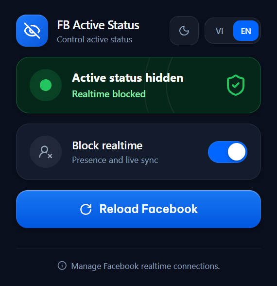

# FB Active Status

English | [Tiếng Việt](README.vi.md)



A Chrome extension (Manifest V3) that makes Facebook and Messenger show "Active 41 minutes ago" instead of "Active now", while keeping the last-active line on screen.

## Why not just turn off Facebook's Active Status?

Facebook's own Active Status toggle hides the "Active 41 minutes ago" line as well. This extension blocks the three WebSocket endpoints that carry presence data, so Facebook falls back to the last-active timestamp and keeps showing it.

## Before and after

Before, the status reads "Active now".


After, it shows the time since last active.


## Installation

1. Download [the extension ZIP](https://github.com/wakupparalyzed/FB-Active-Status/releases/download/v1.0.0/fb-active-status-v1.0.0.zip) and extract it to a folder.
2. Open `chrome://extensions` in Chrome.
3. Turn on Developer mode, then choose Load unpacked.
4. Select the extracted folder that contains `manifest.json`, not the ZIP file itself.
5. Open a Facebook or Messenger tab and reload it. Tabs loaded before you flip the toggle keep the old behaviour.

## Development

Install Node.js 20 or later, then build from source:

```powershell
npm install
npm run build
```

The build writes to `dist/`, which you can load with Load unpacked while developing. Run `npm run typecheck` to check TypeScript without writing output.

## Project structure

- `src/`: TypeScript and CSS sources.
- `public/`: manifest, popup, rules, and local assets. The build regenerates `popup.css` and `fonts/`, so do not edit them by hand.
- `dist/`: built extension. Do not edit.
- `release/`: the ZIP that `publish-release.ps1` uploads to GitHub Releases.

## What it does

- Blocks the realtime WebSocket endpoints at `gateway.facebook.com/ws/realtime`, `gateway.facebook.com/ws/streamcontroller`, and `mqtt-mini.facebook.com`. The rules live in `public/rules/facebook-realtime.json`.
- Turns blocking on or off from the popup.
- Reloads open Facebook and Messenger tabs.
- Switches the popup between Vietnamese and English.
- Follows the system theme or forces light or dark.

## Known effects

Blocking realtime also affects how Facebook and Messenger behave, since the blocked endpoints also carry other data. Test with your own accounts before relying on it. A manually installed extension runs in developer mode, so Chrome shows a warning for it.

## License

[MIT](LICENSE) © wakupparalyzed
