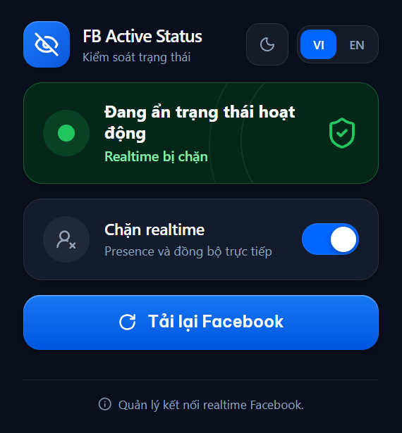

# FB Active Status

[English](README.md) | Tiếng Việt



Extension Chrome này dùng Manifest V3. Nó làm Facebook và Messenger hiển thị thời gian hoạt động gần nhất thay cho "Đang hoạt động".

## Sao không tắt Trạng thái hoạt động của Facebook?

Nút tắt Trạng thái hoạt động của Facebook ẩn cả thời gian hoạt động gần nhất. Extension này chặn ba endpoint WebSocket truyền trạng thái hoạt động để Facebook vẫn hiển thị thời gian đó.

## Minh họa

Trước khi dùng, trạng thái hiển thị "Đang hoạt động".


Sau khi dùng, trạng thái hiển thị thời gian hoạt động gần đây.


## Cài đặt

1. Tải [file ZIP của extension](https://github.com/vacuumbr/FB-Active-Status/releases/download/v1.0.0/fb-active-status-v1.0.0.zip) và giải nén ra một thư mục.
2. Mở `chrome://extensions` trong Chrome.
3. Bật Developer mode, rồi chọn Load unpacked.
4. Chọn thư mục đã giải nén có chứa `manifest.json`, không chọn file ZIP.
5. Mở Facebook hoặc Messenger rồi tải lại tab đó. Tải lại các tab đang mở sau khi bật hoặc tắt chặn.

## Phát triển

Cài Node.js 20 trở lên, rồi build từ mã nguồn:

```powershell
npm install
npm run build
```

Bản build nằm trong `dist/`. Chọn thư mục này bằng Load unpacked để kiểm tra extension trong Chrome.

Dùng `npm run typecheck` để kiểm tra TypeScript mà không tạo tệp. Dùng `npm test` để kiểm tra số tab tải lại, dữ liệu trao đổi giữa popup và background, cùng cách xử lý lỗi.

## Cấu trúc chính

- `src/`: mã nguồn TypeScript và CSS.
- `public/`: manifest, popup, luật chặn và tài nguyên cục bộ. Quá trình build sinh ra tệp `popup.css` và các tệp trong thư mục `fonts/`. Không chỉnh trực tiếp các tệp sinh ra này.
- `dist/`: extension sau khi build. Không chỉnh trực tiếp các tệp trong thư mục này.
- `release/`: các tệp ZIP để tải lên GitHub Releases.

## Extension làm gì

- Chặn các endpoint WebSocket realtime `gateway.facebook.com/ws/realtime`, `gateway.facebook.com/ws/streamcontroller` và `mqtt-mini.facebook.com`. Luật chặn nằm trong `public/rules/facebook-realtime.json`.
- Bật hoặc tắt chặn ngay trong popup.
- Tải lại các tab Facebook và Messenger đang mở.
- Chuyển ngôn ngữ popup giữa VI và EN.
- Dùng giao diện theo hệ thống hoặc chọn cố định giao diện sáng hay tối.

## Ảnh hưởng đã biết

Các endpoint bị chặn còn truyền dữ liệu khác ngoài trạng thái hoạt động. Extension cũng chặn dữ liệu đó. Hãy thử trên tài khoản của bạn trước khi dùng lâu dài.

Chrome hiện cảnh báo với các extension cài qua Developer mode.

## Giấy phép

[MIT](LICENSE) © wakupparalyzed
